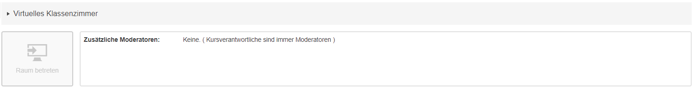

# digitalClassroom_autoRefresh
> **Careful**: This only works for digital classrooms from OPAL (Bildungsportal Sachsen).

#### 1. Schritt: Eine beliebigen virtuellen Klassenraum auf OPAL heraussuchen.

#### 2. Schritt: Entwickler-Konsole aufrufen und anschließend auf "Console" klicken.
- `[F12]` oder
- `[Strg]`+`[Umschalt]`+`[J]` oder
- `[⌘]`+`[Optionstaste]`+`[J]`

#### 3. Schritt: Den Code ([Solution 1](./solution%231.js) oder [Solution 2](./solution%232.js)) kopieren, einfügen und `[Enter]` drücken.

## Wo ist der Unterschied der beiden Skripte? 
Das erste Skript lädt nur den #main-content mit neuen Daten herunter. Das zweite Skript kapselt die Seite in ein iframe und lädt die _gesamte Seite_, inklusive nicht cached Skripte, Fonts, usw. neu. Das macht das erste Skript effizienter, dafür ist das zweite Skript weniger Fehleranfällig. 
